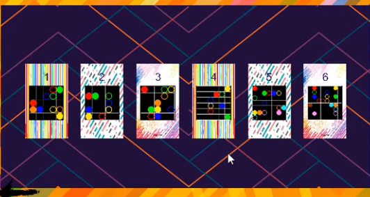
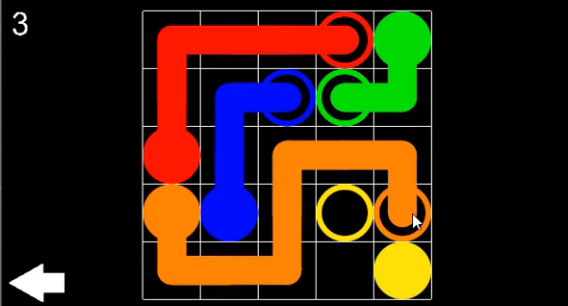

# Flow Free - Practical Programming Aplicada - February 2020

## Made by

- Audric Rosario
- Zheng Peng Li

### Presentation

### Features

- Sprites
- Prefabs
- Escenas
- Plugins
- Scripts

### Menu

### Levels

### Game

