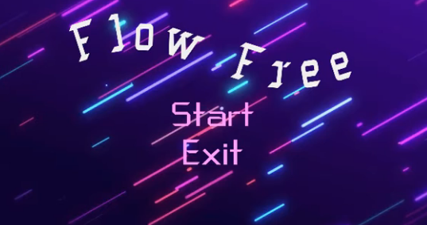

# Flow Free - Tarea de Programación Aplicada - Febrero de 2020

## Elaborado por

- Audric Rosario
- Zheng Peng Li

### Presentación

### Utiliza

- Sprites
- Prefabs
- Escenas
- Plugins
- Scripts

### Menú

### Niveles

### Juego

